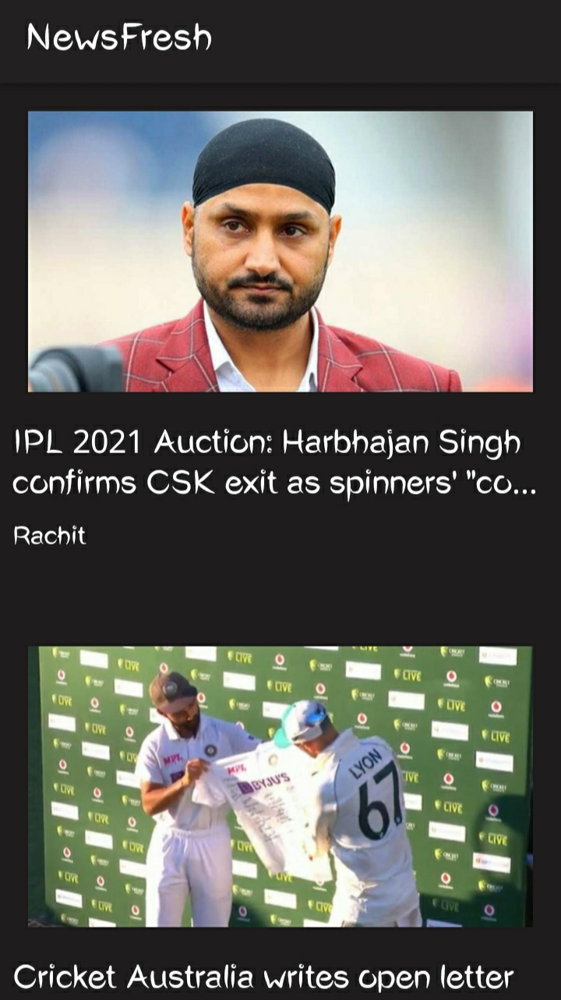
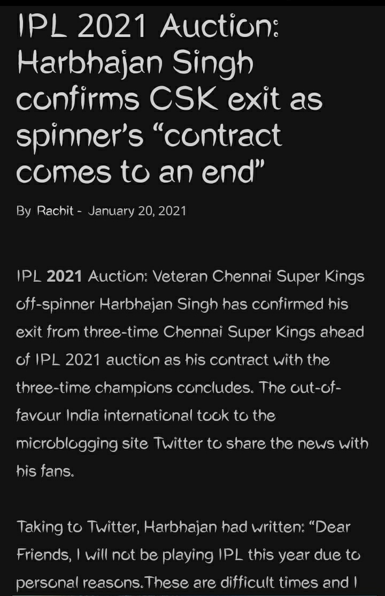

# NewsFresh App
### An Indian News App

# About the App #
### Language Used - Kotlin 
### API used - NewsApI

### User can:

- View a number of top general news (scroll down to get more)
- Watch the details of the news i.e, image, headlines and the author
- Click on the image to view the detailed article to it

### Uses :

- RecyclerView
- Volley
- Glide

# Screenshots :  

  &nbsp;&nbsp;&nbsp;&nbsp;&nbsp;
  &nbsp;&nbsp;&nbsp;&nbsp;&nbsp;
  &nbsp;&nbsp;&nbsp;&nbsp;&nbsp;

After clicking on a news, you will get redirected to the site to read the full article (in your browser)
For example: 

&nbsp;&nbsp;&nbsp;&nbsp;&nbsp;

This is the site where I got redirected to.

# How to use it?
### Clone the repo , open it in Android Studio and try it out in your Physical Device or Emulator.

# How to contribute?
### Fork the repo , make changes and give a valid Pull Request.
